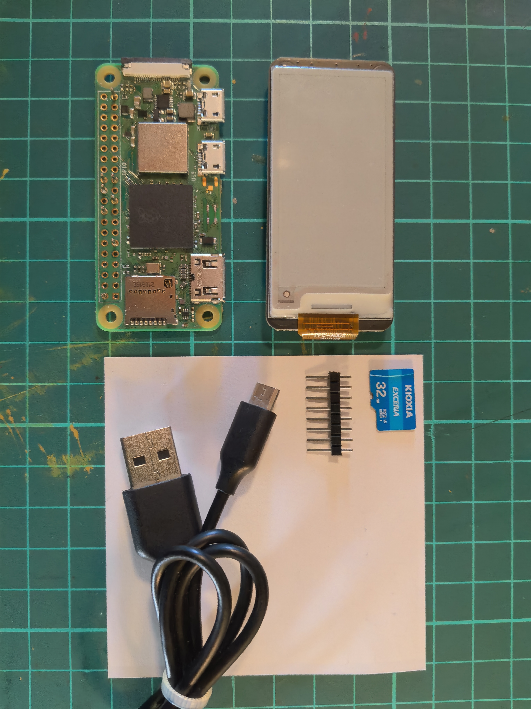
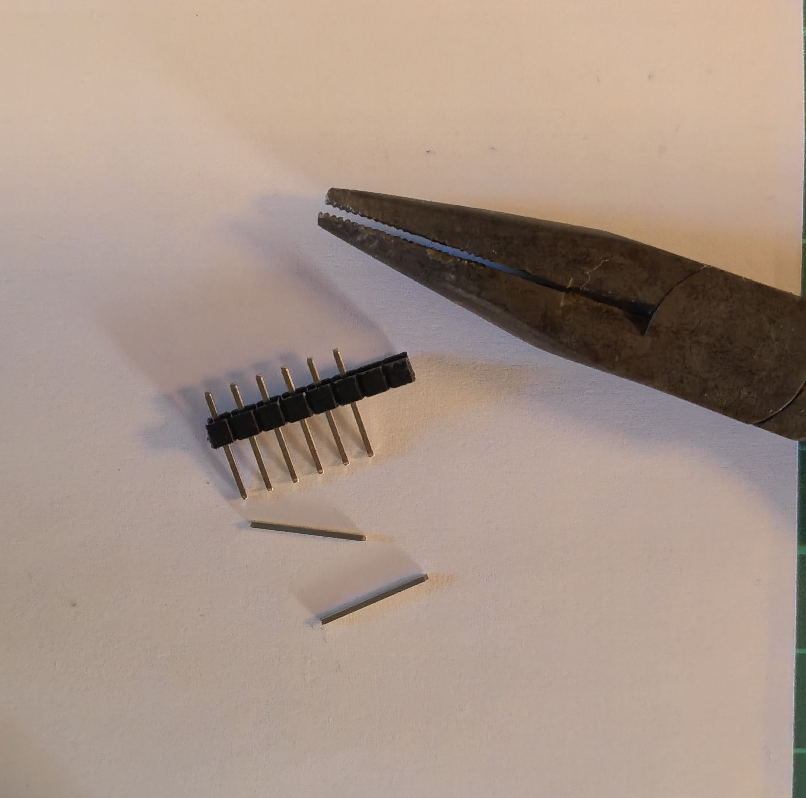
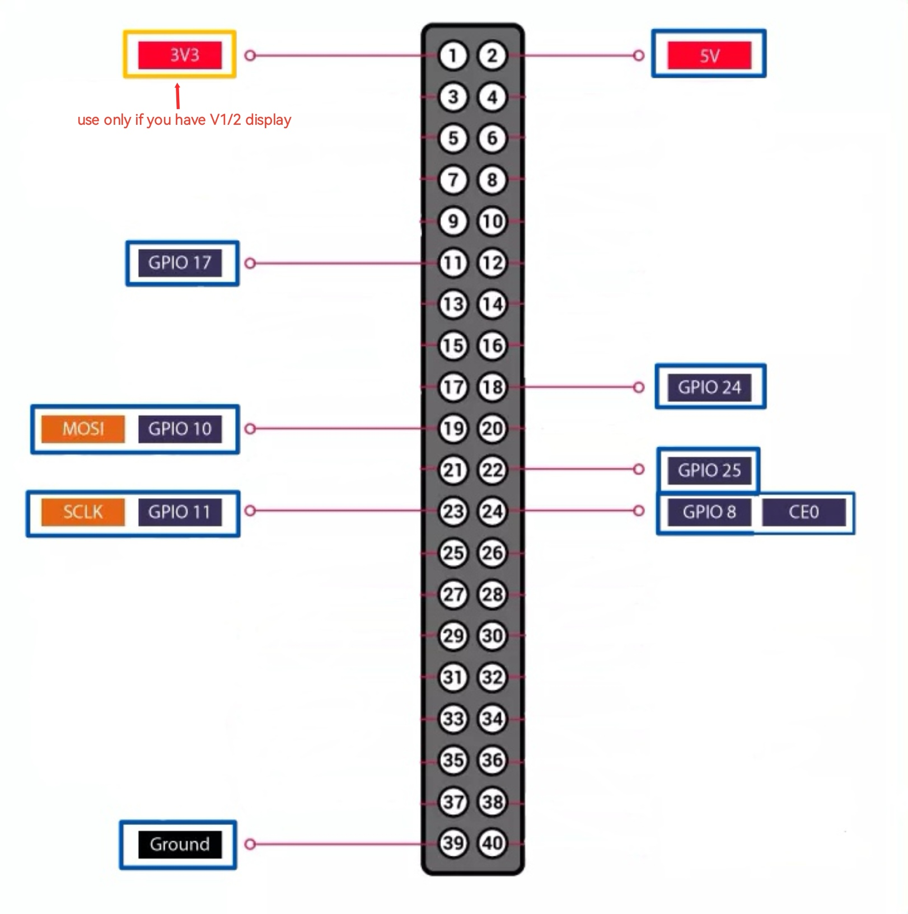
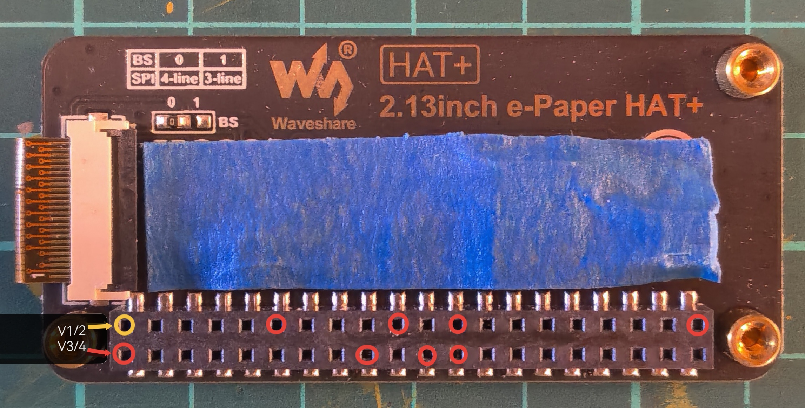
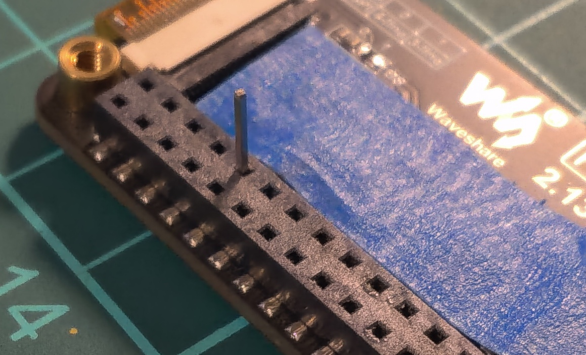
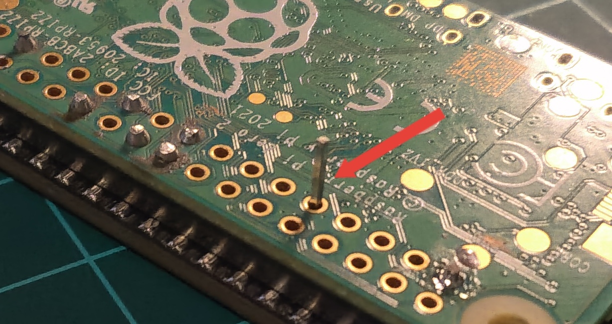

# Hardware 

- Waveshare e-ink Display - There is a different versions of this Display. I am using V4. 
- Raspberry pi zero 2w - You can use 0W too
- Micro SD Card - Use min. 16gb and dont use crappy/cheap ones. Speed affects so much. You need SD Card reader to connect to PC.
- Micro USB cable - It needs to be USB so we can SSH through it first time. 
- Male headers
  

 ### TOOLS  
- Soldering Iron  
- Side Cutters or Nail Clipper  
### BUY
- [Display V4](https://s.click.aliexpress.com/e/_ol9iv65)
- [Display V3](https://s.click.aliexpress.com/e/_opfodKH)
- [SD Card](https://s.click.aliexpress.com/e/_okBzJVF)
- [Cheap SD Card Reader](https://s.click.aliexpress.com/e/_oEEspjB)

# Installation

- Pull pins from the plastic part (8 total)

&nbsp;

- Put masking/electrical tape to back of the screen  
- We are going to solder just necessary pins for screen to work.(Left is PI pinout)  
- V1/2 displays uses 3.3V so use 3.3 pin of the pi (Desolder if your screen have a big socket on the middle)  
- V3/4 displays uses 5V so use 5V pin of the pi

    

&nbsp;

- Insert headers to screens female headers. Look previous step to check pins
- Set your PI upside down and solder all headers
- Cut headers flush with side cutters or nail clipper

    

# Done

Your Slimagotchi is ready!! To give it a life go [Jayofelony Guide](https://github.com/jayofelony/pwnagotchi/wiki/Step-1-Installation-for-raspberry-pi)

  

## Buy Me Pizza

